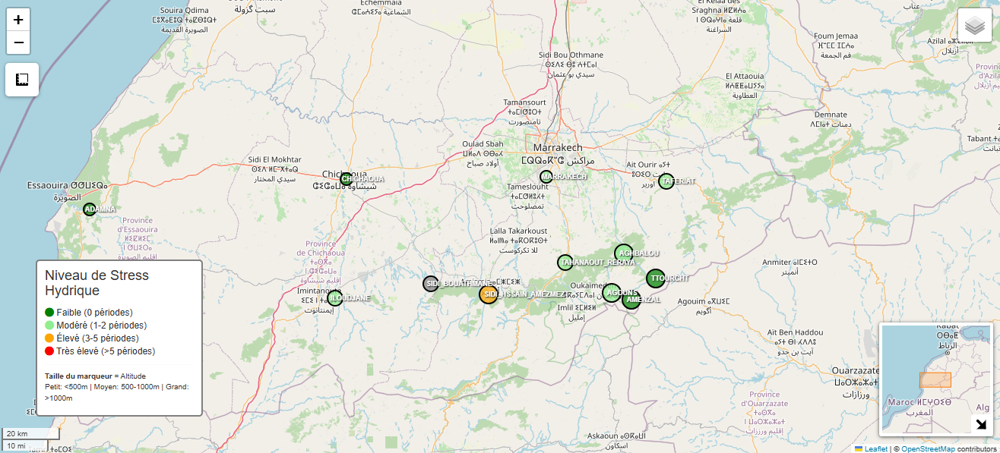

# 🌍 Détection du Stress Hydrique Agricole - Bassin du Tensift

<div align="center">
  
  <p><em>Distribution spatiale des stations et niveaux de stress hydrique dans le bassin du Tensift</em></p>
</div>

[](https://www.python.org/)
[](https://earthengine.google.com/)
[](LICENSE)

---

## 📋 Table des Matières
- [Vue d'Ensemble](#vue-densemble)
- [Contexte du Projet](#contexte-du-projet)
- [Méthodologie](#méthodologie)
- [Architecture Technique](#architecture-technique)
- [Installation & Configuration](#installation--configuration)
- [Utilisation](#utilisation)
- [Résultats Clés](#résultats-clés)
- [Structure du Projet](#structure-du-projet)
- [Dépendances](#dépendances)
- [Auteurs & Contributions](#auteurs--contributions)
- [Licence](#licence)

---

## 🎯 Vue d'Ensemble

**Badge :** [] [] []

Pipeline complet de Data Science géospatiale pour la détection précoce du stress hydrique agricole par télédétection satellitaire. Combine données Sentinel-2, MODIS et mesures pluviométriques in-situ sur 12 stations du bassin du Tensift (Maroc).

**Période d'analyse :** 2015-2019 (5 ans)  
**Zone d'étude :** Bassin du Tensift (29 000 km²)  
**Technologies :** Python, Google Earth Engine, Machine Learning

### 🔬 Principaux Résultats
- **8 périodes de stress** identifiées sur le bassin
- **Corrélations validées** : r > 0.5 entre précipitations et NDVI
- **3 clusters agro-climatiques** distincts identifiés
- **Zones prioritaires** : SIDI_HSSAIN_AMEZMEZ (3 stress), CHICHAOUA (dégradation critique)

---

## 🌐 Contexte du Projet

### Problématique
Le bassin du Tensift, grenier agricole du Maroc central, fait face à :
- Stress hydrique croissant (changement climatique)
- Surexploitation des nappes phréatiques
- Dégradation des sols et désertification

### Objectifs
1. Développer un système d'alerte précoce du stress hydrique
2. Identifier les zones vulnérables nécessitant une intervention
3. Valider l'approche par corrélation avec données au sol
4. Fournir un outil décisionnel pour la gestion de l'eau

### Innovation
Fusion de données multi-sources (optique, thermique, in-situ) via Google Earth Engine pour une analyse à l'échelle du bassin versant.

---

## 📊 Méthodologie

### 1. Acquisition des Données

#### Données Satellitaires (Google Earth Engine)
- **Sentinel-2 (10m)** : NDVI, NDWI (santé végétale, humidité)
- **MODIS (1km)** : LST (température de surface)
- **Fréquence** : Composites mensuels (médiane) 2015-2019

#### Données In-Situ
- **12 stations pluviométriques** (ABHT)
- **Gradient altitudinal** : 70m à 2230m
- **Données journalières** agrégées en mensuelles

### 2. Détection du Stress

#### Calcul des Anomalies (Z-score)
```bash
Z = (Valeur_actuelle - Moyenne_historique_mois) / Écart-type_historique_mois
```

**Seuils de stress :**
- NDVI Z-score < -1.5 → Stress végétal
- LST Z-score > +1.5 → Stress thermique
- Stress hydrique = NDVI bas + LST haut + Précipitations faibles

### 3. Analyses Statistiques
- Corrélations précipitations vs indices
- Clustering hiérarchique (K-means, Ward)
- Analyses bivariées multi-variables
- Cartographie interactive (Folium)

---

## 🏗️ Architecture Technique

### Design Pattern : Modularité & OOP

```markdown
stress-hydrique-tensift/
├── config.py              # Configuration centralisée
├── utils.py               # Conversion coordonnées Lambert→WGS84
├── precipitation.py       # Classe PrecipitationManager
├── gee_data.py           # Classe SatelliteDataManager
├── analysis.py           # Classe StressAnalysis
├── visualization.py      # Classe ReportGenerator
├── advanced_analysis.py  # Analyses statistiques avancées
├── create_interactive_map.py  # Carte Folium
├── generate_html_report.py    # Rapport consolidé
└── main.py               # Orchestrateur principal
```

### Flux d'Exécution
```bash
main.py
  ↓
  ├→ PrecipitationManager → Chargement & nettoyage CSV
  ├→ SatelliteDataManager → Extraction GEE (NDVI, NDWI, LST)
  ├→ StressAnalysis → Calcul Z-scores & détection
  ├→ ReportGenerator → Visualisations (matplotlib)
  ├→ AdvancedAnalysis → Clustering & corrélations
  └→ InteractiveMap → Carte Folium
```

---

## ⚙️ Installation & Configuration

### Prérequis
- Python 3.12+
- Compte Google Earth Engine
- Project ID GEE configuré

### Installation

```bash
# 1. Cloner le repository
git clone https://github.com/votre-username/stress-hydrique-tensift.git
cd stress-hydrique-tensift

# 2. Créer l'environnement virtuel
python -m venv venv
source venv/bin/activate  # Linux/Mac
venv\Scripts\activate     # Windows

# 3. Installer les dépendances
pip install -r requirements.txt

# 4. Créer la structure des dossiers
python setup_structure.py

# 5. Authentification GEE (première utilisation uniquement)
python -c "import ee; ee.Authenticate()"
```

### Configuration
Modifier `config.py` :
```python
# Votre Project ID Google Earth Engine
PROJECT_ID = 'votre-project-id'

# Période d'analyse
ANALYSIS_PERIOD = ('2015-01-01', '2019-12-31')
```

### Données d'Entrée
Placer le fichier `rainfall_data.xlsx` dans le dossier `/data`.

---

## 🚀 Utilisation

### Exécution Rapide (Test)
```bash
python main.py
# Choisir option 1 : TEST RAPIDE (2018-2019, MARRAKECH uniquement)
```

### Analyse Complète
```bash
python main.py
# Choisir option 3 : ANALYSE COMPLÈTE (1998-2019, toutes stations)
# Durée estimée : 1-2 heures
```

### Analyses Avancées
```bash
# Clustering et corrélations inter-stations
python advanced_analysis.py

# Carte interactive
python create_interactive_map.py

# Rapport HTML consolidé
python generate_html_report.py
```

### Outputs Générés

```bash
output/
├── *_raw_data.csv              # Données brutes par station
├── *_with_anomalies.csv        # Z-scores calculés
├── stations_comparison_summary.csv  # Tableau comparatif
├── plots/
│   ├── *_timeseries.png        # Séries temporelles
│   ├── *_correlation.png       # Corrélations
│   ├── *_climatology.png       # Climatologies
│   ├── correlation_matrix_stations.png
│   ├── clustering_dendrogram.png
│   └── bivariate_analysis.png
└── maps/
    ├── carte_interactive_stations.html
    └── rapport_final_stress_hydrique.html
```

---

## 📈 Résultats Clés

### Clustering des Stations (3 Groupes)

| Cluster | Stations | Caractéristiques |
|---------|----------|------------------|
| **1. Haute Montagne** | TTOURCHT, AGOUNS, AMENZAL | Alt >1600m, NDVI bas, pastoral |
| **2. Plaines Semi-Arides** | CHICHAOUA, MARRAKECH, ADAMNA, ILOUDJANE | <800m, stress thermique, dégradation |
| **3. Piémont Productif** | AGHBALOU, SIDI_HSSAIN_AMEZMEZ, TAFERIAT, TAHANAOUT | 700-1100m, agricole intensif |

### Corrélations Significatives
- **MARRAKECH** : Pluie-NDVI r=0.534 ✓
- **ADAMNA** : Pluie-LST r=-0.690 (forte inverse) ✓
- **TAFERIAT** : Pluie-NDVI r=0.554 ✓

### Zones Prioritaires
1. **CHICHAOUA** : NDVI <0.12, désertification avancée
2. **SIDI_HSSAIN_AMEZMEZ** : 3 stress détectés, surexploitation probable
3. **TAHANAOUT_RERAYA** : Données pluviométriques à vérifier

---

## 📂 Structure Détaillée du Projet

```bash
stress-hydrique-tensift/
│
├── README.md                     # Ce fichier
├── requirements.txt              # Dépendances Python
├── .gitignore                    # Fichiers à ignorer
│
├── config.py                     # Configuration (stations, paramètres GEE)
├── utils.py                      # Utilitaires (conversion coordonnées)
│
├── precipitation.py              # Gestion données pluviométriques
├── gee_data.py                   # Interface Google Earth Engine
├── analysis.py                   # Calcul des anomalies
├── visualization.py              # Génération graphiques
├── advanced_analysis.py          # Statistiques avancées
├── create_interactive_map.py     # Carte Folium
├── generate_html_report.py       # Rapport HTML
├── main.py                       # Orchestrateur principal
│
├── data/
│   └── rainfall_data.xlsx        # Données d'entrée (non versionné)
│
└──output/                       # Résultats générés (non versionné)
    ├── maps/
    ├── plots/
    └── *.csv
```

---

## 📦 Dépendances

### Core
- `python >= 3.12`
- `pandas == 2.1.4`
- `numpy == 1.26.2`

### Géospatial
- `earthengine-api == 0.1.384`
- `geemap == 0.30.1`
- `geopandas == 0.14.1`
- `pyproj == 3.6.1`

### Visualisation
- `matplotlib == 3.8.2`
- `seaborn == 0.13.0`
- `folium == 0.15.1`

### Machine Learning
- `scikit-learn == 1.3.2`
- `scipy >= 1.5.0`

Voir `requirements.txt` pour la liste complète.

---

## 📄 Licence

Ce projet est sous licence MIT. Voir le fichier `LICENSE` pour plus de détails.

---

## 🔗 Liens Utiles

- [Documentation Google Earth Engine](https://developers.google.com/earth-engine)
- [Guide Sentinel-2](https://sentinel.esa.int/web/sentinel/missions/sentinel-2)
- [MODIS Land Surface Temperature](https://modis.gsfc.nasa.gov/data/dataprod/mod11.php)

---

**⭐ Si ce projet vous est utile, n'hésitez pas à lui donner une étoile !**

Ce README couvre tous les aspects techniques, méthodologiques et pratiques pour permettre à quiconque de comprendre, reproduire et étendre votre travail. La structure est optimisée pour GitHub avec badges, emojis, tableaux et blocs de code formatés.
